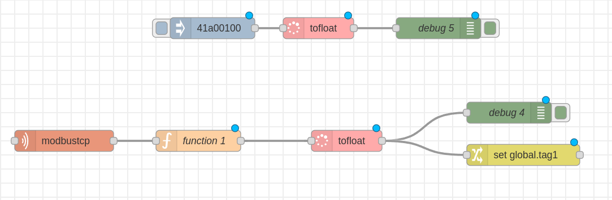
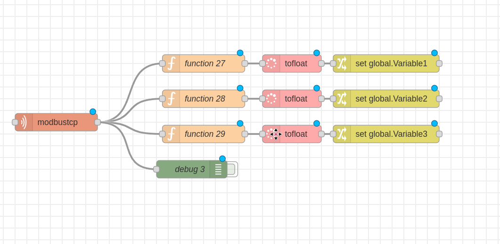
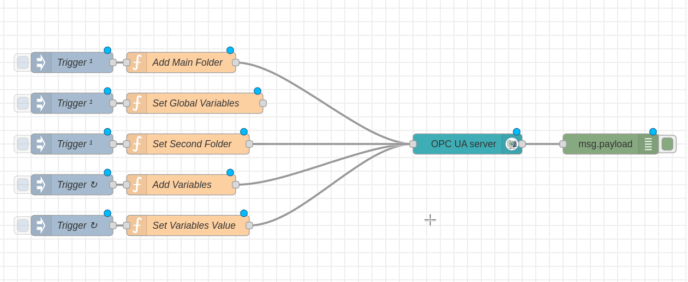

# Node-RED Modbus to OPC UA Server Example

This project demonstrates how to use **Node-RED** to:

* Read **single and multiple Modbus TCP registers**
* Convert raw Modbus register data to **32-bit floating-point values**
* Expose the values through an **OPC UA Server**

The project is intended as a **practical reference** based on hands-on experience with Modbus and OPC UA integration.

---

## 📦 Project Files

The following Node-RED flows are provided and can be imported directly:

* `readSingleModbusRegister.json`
* `readMultipleModbusRegister.json`
* `opcuaServer.json`

Each flow is explained below.

---

## 🔧 Prerequisites

* Node-RED (tested with recent versions)
* Modbus TCP device or simulator
* OPC UA client (e.g. UaExpert) for testing

---

## 🔌 Required Node-RED Plugins

Install the following Node-RED plugins:

1. Open **Node-RED**
2. Go to **Menu → Manage Palette → Install**
   Shortcut: `Alt + P`
3. Install these packages:

```text
node-red-contrib-tofloat
node-red-contrib-modbustcp
node-red-contrib-opcua
```

---

## 🔁 Flow 1: Read Single Modbus Register

This flow reads a **single Modbus value** (typically a 32-bit float stored in two 16-bit registers), converts it, and stores it in a global variable.

### 📷 Flow Diagram

```text

```

### ⚙️ How It Works

1. **Modbus TCP Node**

   * Configure the Modbus server:

     * IP address
     * Port
   * Set parameters:

     * **Address**: Starting register address
     * **Quantity**: Number of registers to read

       * Example: Float = `2` registers (2 × 16-bit)
     * **Poll Rate**: Interval between reads
     * **Endian**:

       * Big Endian → `A B`
       * Little Endian → `B A`

2. **Function Node**

   * Extracts register values from the Modbus response
   * Converts two 16-bit registers into a single 32-bit hex value

3. **tofloat Node**

   * Converts the 32-bit hex value into a floating-point number
   * Equivalent to a `reinterpret_cast` or `memcpy` in C/C++

4. **Set Global Value**

   * Stores the converted float in a **global variable**
   * This value is later used by the OPC UA server flow

---

## 🔁 Flow 2: Read Multiple Modbus Registers

This flow reads **multiple Modbus registers at once** using a single Modbus TCP node.

### 📷 Flow Diagram

```text

```

### ⚙️ How It Works

* A single **Modbus TCP node** reads a range of registers:

  * Starting address
  * Quantity covering all required registers
* A **Function node**:

  * Extracts individual register pairs
  * Combines them into 32-bit values
* **tofloat nodes** convert each value into floats
* Each value is stored in a corresponding **global variable**

This approach is more efficient than using multiple Modbus nodes.

---

## 🖥️ Flow 3: OPC UA Server

This flow creates an **OPC UA server**, dynamically adds folders and variables, and continuously updates variable values from global context.

### 📷 Flow Diagram

```text

```

---

## 🗂️ OPC UA Server Architecture

```
OPC UA Root
└── MainFolder
    └── SecondFolder
        ├── Variable1
        ├── Variable2
        └── Variable3
```

---

## 📁 Adding the Main Folder

> ⚠️ OPC UA commands are executed **based on inject node timing**
> Make sure folders are created **before** variables are added.

### Function Node: Add Main Folder

```js
msg = {
    payload: {
        opcuaCommand: "addFolder"
    },
    topic: "ns=1;s=MainFolder"
};

return msg;
```

---

## 🌐 Setting Global Variables

This node initializes global variables used by both Modbus and OPC UA flows.

### Function Node: Set Global Variables

```js
var myGlobalList = [
    "Variable1",
    "Variable2",
    "Variable3"
];

global.set("TopicLists", myGlobalList);
global.set("CounterAdd", 0); // Counter for adding OPC UA variables
global.set("CounterSet", 0); // Counter for setting OPC UA values

node.warn("Global list set: " + JSON.stringify(global.get("TopicLists")));
return msg;
```

---

## ➕ Adding OPC UA Variables

Variables are added **one by one** using a repeating trigger and a global counter.

### Function Node: Add Variable

```js
let list = global.get("TopicLists");
let cnt_key = "CounterAdd";
let cnt = global.get(cnt_key);

if (cnt < list.length && list[cnt] !== undefined) {
    let topic_modify = "ns=1;s=" + list[cnt] + ";datatype=Float";
    msg = {
        payload: {
            opcuaCommand: "addVariable"
        },
        topic: topic_modify
    };
    global.set(cnt_key, cnt + 1);
    return msg;
} else {
    return null;
}
```

---

## 🔄 Setting OPC UA Variable Values

This node continuously updates OPC UA variables with values coming from Modbus.

### Function Node: Set Variable Value

```js
let list = global.get("TopicLists");
let cnt_key = "CounterSet";
let cnt = global.get(cnt_key);

if (cnt < list.length && list[cnt] !== undefined) {
    let topic_name = list[cnt];
    let val = global.get(topic_name);

    if (val === undefined) {
        val = -1;
        node.warn("Value undefined for " + topic_name);
    }

    msg = {
        payload: {
            messageType: "Variable",
            variableName: topic_name,
            datatype: "Float",
            namespace: "1",
            variableValue: val
        }
    };

    global.set(cnt_key, cnt + 1);
    return msg;
} else {
    global.set(cnt_key, 0);
    return null;
}
```

---

## 🧪 Testing

* Use **UaExpert** or another OPC UA client
* Connect to the Node-RED OPC UA server
* Verify:

  * Folder structure
  * Variable creation
  * Live value updates

---

## ✅ Summary

This project shows:

* Efficient Modbus TCP reading (single & multiple registers)
* Safe conversion of Modbus data to floating-point values
* Dynamic OPC UA server construction in Node-RED
* Scalable variable management using global context

---

If you want, I can also:

* Clean up the Node-RED flows
* Add **naming conventions**
* Add a **diagram (ASCII or SVG)**
* Turn this into a **GitHub-ready repo structure**

Just tell me 👍
